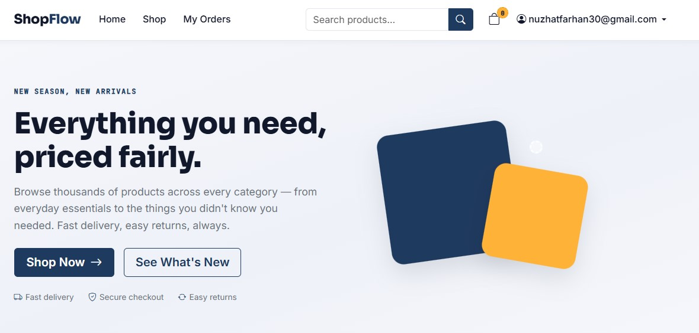
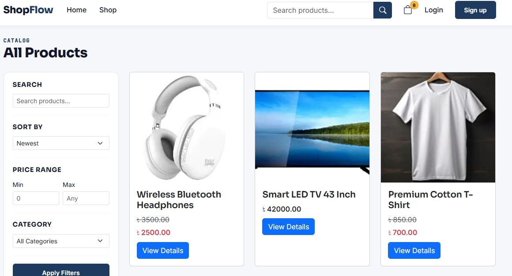
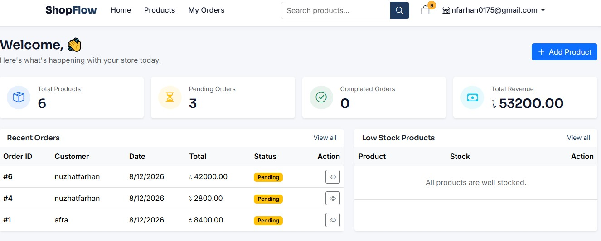
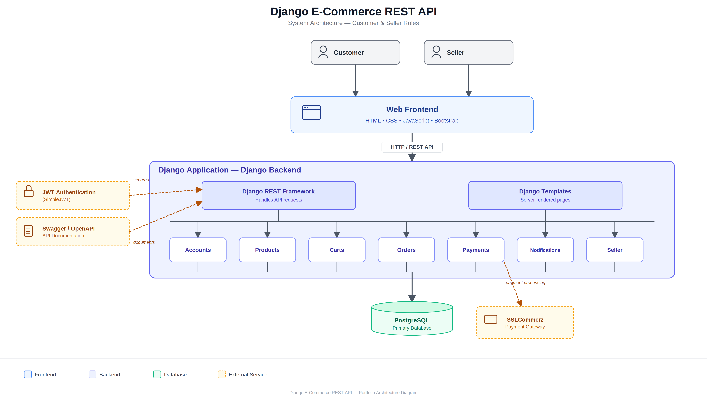

# Django E-Commerce Platform

A full-stack e-commerce web application built with Django, Django REST Framework, JavaScript, and PostgreSQL. Developed as a portfolio project to explore real-world e-commerce architecture, REST API design, authentication, database modeling, and frontend-backend integration.

The platform includes JWT authentication, product management, a shopping cart, order processing, payments, product reviews, search and filtering, discount management, and seller functionality. Some features are still under active development.

---

## Table of Contents

- [Screenshots](#screenshots)
- [Features](#features)
- [User Roles](#user-roles)
- [Technology Stack](#technology-stack)
- [System Architecture](#system-architecture)
- [Database Design / ERD](#database-design--erd)
- [API Documentation](#api-documentation)
- [Installation & Setup](#installation--setup)
- [Testing](#testing)
- [Future Plans](#future-plans)
- [License](#license)

---

## Screenshots

| Home & Product Listing | Product Details & Cart | Seller Dashboard |
|---|---|---|
|  |  |  |

---

## Features

### Authentication & User Management
- Custom user model with email-based login
- JWT authentication via SimpleJWT (access + refresh tokens)
- Logout with token blacklisting
- Protected API endpoints and role-based permissions

### Product Management
- Product and category management with full CRUD
- Product image upload and stock management
- Product reviews and ratings
- Seller-specific product management and availability checks

### Shopping & Order Management
- User-specific shopping cart (add, update, remove items)
- Automatic subtotal and total calculation
- Checkout with delivery address and order summary
- Multiple payment method support
- Order history, status management, and automatic stock reduction
- Cart clearing after order placement
- Separate order views for customers and sellers

### Payments
- Cash on Delivery (COD)
- SSLCommerz payment gateway integration
- Transaction and payment status tracking with callback handling
- Supported statuses: `Pending`, `Success`, `Failed`, `Cancelled`, `Refunded`

### Seller Dashboard
- Dedicated dashboard for sellers
- Product CRUD, image, and stock management
- Discount configuration
- Seller-specific order management

### Search & Filtering
- Product search
- Category-based and attribute filtering

---

## User Roles

**Customer**
- Browse, search, and filter products
- View product details and reviews
- Manage cart, addresses, and profile
- Place orders, make payments, and view order history
- Write product reviews

**Seller**
- Access the seller dashboard
- Add, update, and delete products
- Manage product images, stock, and discounts
- View and manage relevant orders

---

## Technology Stack

| Layer | Technologies |
|---|---|
| Backend | Python, Django, Django REST Framework, SimpleJWT |
| Frontend | HTML5, CSS3, JavaScript (communicates with backend via REST APIs) |
| Database | PostgreSQL |
| Payments | SSLCommerz |
| API Docs | Swagger / OpenAPI |
| Config | django-environ |
| Tooling | Thunder Client, Git, GitHub |

---

## System Architecture

The application follows a modular Django architecture with a REST API backend and a JavaScript frontend.



## Database Design / ERD

The schema models relationships between users, products, carts, orders, payments, and other core entities.


### API Documentation
Interactive API documentation is available through Swagger UI and ReDoc. The underlying OpenAPI schema is also available for direct access.

| Resource | URL |
|---|---|
| **OpenAPI Schema** | `/api/schema/` |
| **Swagger UI** | `/api/docs/` |
| **ReDoc** | `/api/redoc/` |

- **OpenAPI Schema:** Provides the machine-readable API specification.
- **Swagger UI:** Interactive API documentation for exploring and testing endpoints.
- **ReDoc:** Alternative interface for browsing and reading the API documentation.

---

## Installation & Setup

### Prerequisites
- Python 3.x
- PostgreSQL
- Git
- pip / virtualenv

### 1. Clone the repository
```bash
git clone https://github.com/your-username/your-repository.git
cd your-repository
```

### 2. Create a virtual environment
```bash
python -m venv venv

# Windows
venv\Scripts\activate

# Linux / macOS
source venv/bin/activate
```

### 3. Install dependencies
```bash
pip install -r requirements.txt
```
Key packages: Django, Django REST Framework, `djangorestframework-simplejwt`, `django-environ`, PostgreSQL driver, and SSLCommerz integration dependencies.

### 4. Create the PostgreSQL database
```sql
CREATE DATABASE ecommerce_db;
```
Create or use a PostgreSQL user with access to this database.

### 5. Configure environment variables
Create a `.env` file in the project root:
```env
SECRET_KEY=your-secret-key
DEBUG=True
DB_NAME=ecommerce_db
DB_USER=your_database_user
DB_PASSWORD=your_database_password
DB_HOST=localhost
DB_PORT=5432

# Optional — if SSLCommerz is enabled
SSLCOMMERZ_STORE_ID=your_store_id
SSLCOMMERZ_STORE_PASSWORD=your_store_password
```

### 6. Verify Django settings
Ensure the project reads environment variables via `django-environ` and that the database points to PostgreSQL:
```python
DATABASES = {
    "default": env.db()
}
```

### 7. Apply migrations
```bash
python manage.py makemigrations
python manage.py migrate
```

### 8. Create a superuser
```bash
python manage.py createsuperuser
```
The project uses email as the primary login field — provide both email and username when prompted.

### 9. Collect static files (production-like setup)
```bash
python manage.py collectstatic
```
Not required for local development with `DEBUG=True`.

### 10. Create the media directory
```bash
mkdir media
```
Used for uploaded product images and profile pictures.

### 11. Run the development server
```bash
python manage.py runserver
```
The app will be available at `http://127.0.0.1:8000/`.

### Quick start (after initial setup)
```bash
# Activate virtual environment
source venv/bin/activate   # or venv\Scripts\activate on Windows

# Apply migrations and run
python manage.py migrate
python manage.py runserver
```

### Access points
| Resource | URL |
|---|---|
| App | `http://127.0.0.1:8000/` |
| Django Admin | `http://127.0.0.1:8000/admin/` |
| Swagger UI | `http://127.0.0.1:8000/api/docs/` |
| ReDoc | `http://127.0.0.1:8000/api/redoc/` |

---

## Testing

**API Testing** — performed with Thunder Client, covering:
- Authentication and JWT token flow
- User and profile management
- Product CRUD operations and reviews
- Cart operations, checkout, and order creation
- Payment flow
- Seller operations
- Search and filtering

**Interactive testing** is also available through Swagger UI.

---
# ShopFlow E-commerce API

## Live Demo
https://django-rest-framework-drf-2.onrender.com/home/

## API Documentation
https://django-rest-framework-drf-2.onrender.com/api/docs/
---

## Future Plans

- Complete notification system
- Saved address management and checkout address selection
- Wishlist functionality
- Coupon and promotional discount system
- Pagination and advanced filtering
- Inventory and low-stock alerts
- Automated unit and integration testing
- Docker containerization
- Improved UI/UX and responsive design
- Production deployment and optimization
